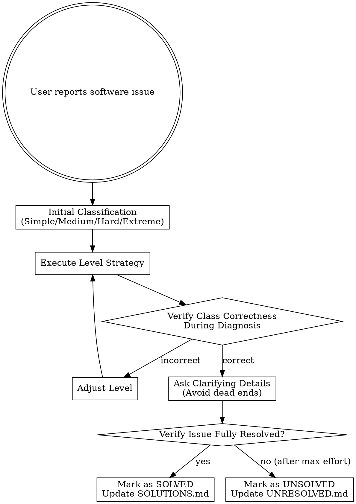

# Troubleshooting Computer Issues

## Overview
A structured, platform-agnostic engine designed to systematically debug, verify, and resolve computer software and configuration issues while recording long-term troubleshooting memory.

## Core Flow

## Level Strategies

Refer to [diagnostic-templates.md](references/diagnostic-templates.md) for full checklists.

| Difficulty | Diagnostic Strategy | Verification Method |
| :--- | :--- | :--- |
| **Simple (简单)** | Use existing knowledge base & quick references | Manual/verbal verification |
| **Medium (中等)** | Network search (docs/blogs) + deep thinking mode | Check version/logs |
| **Hard (困难)** | Medium strategy + run terminal/diagnostic commands | Execute validation scripts/commands |
| **Extreme (极其困难)** | Hard strategy + parallel subagent tasks + iterate | Complete test passes & regression check |

## Rules & Common Mistakes
- **Never guess fixes**: Run diagnostic commands for Hard/Extreme issues before proposing changes. Refer to [systematic-debugging](file:///C:/Users/Lenovo/.gemini/config/skills/systematic-debugging-5.1.0/SKILL.md).
- **Dynamic Reclassification**: If search fails or environmental complexity increases, adjust the difficulty level immediately.
- **Strict Resolution Gate**: Only mark as SOLVED after the user explicitly verifies the fix. If unresolved after maximum effort, mark as UNSOLVED.
- **Memory Documentation**: Every attempt must write to `.troubleshooting-memory/` as detailed in [memory-format.md](references/memory-format.md).

## Quick References
- [Diagnostic Templates](references/diagnostic-templates.md)
- [Memory Format Specification](references/memory-format.md)
- [Common Solutions Index](references/common-solutions.md)
